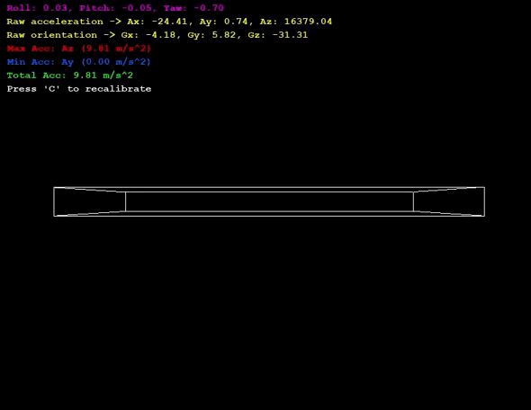
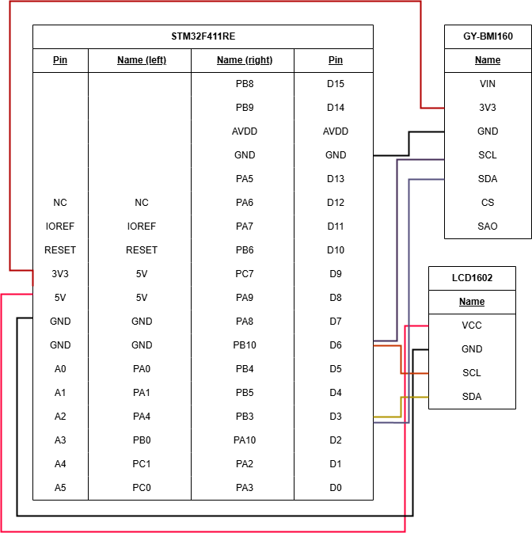
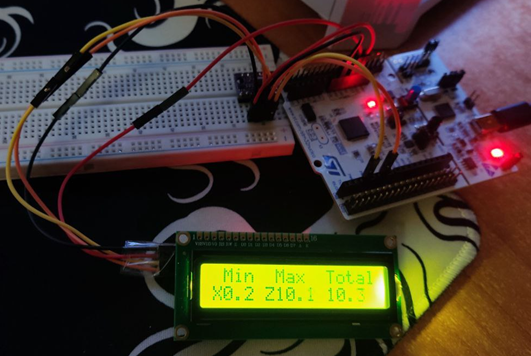
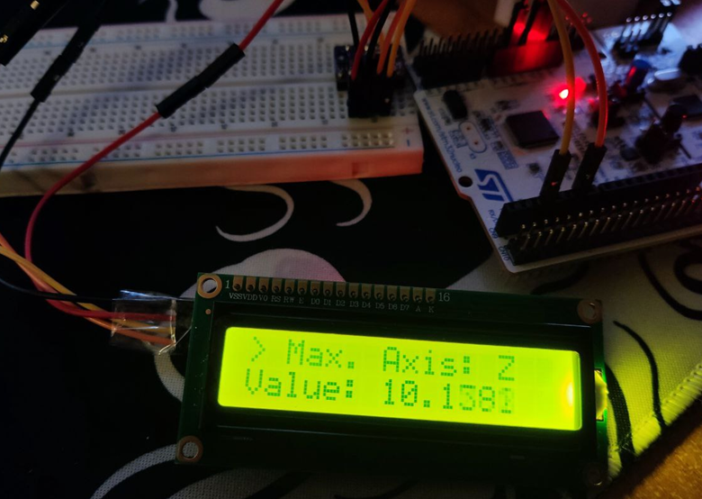

# STM32-BMI160-IMU-Visualizer

Real-time 3D visualization system for BMI160 IMU sensor data using STM32 microcontroller and Python visualization frontend.



## Features

- Real-time 3D visualization of sensor orientation
- Data processing on STM32 with FreeRTOS
- LCD1602 display for showing acceleration data
- Complementary filter for sensor fusion
- Calibration system for improved accuracy
- Serial communication between STM32 and PC
- Moving average filter for noise reduction


## Hardware Requirements

- STM32F4xx series microcontroller
- BMI160 IMU sensor
- USB-UART converter
- Connecting wires

Not actually required, but used in the project:
- LCD1602 display with I2C interface

### Connection Diagram



---

### STM32 (Backend)
- STM32F411RE Board
- STM32CubeMX (6.12.0)
- VSCode (STM32 VSCODE EXTENSION)
- FreeRTOS (10.3.1 CMSIS_V2)
- BMI160 driver by Bosch Sensortec. [[Repository]](https://github.com/boschsensortec/BMI160_SensorAPI)
- LCD1602 I2C library

**The automatically generated source code is not included in the repository, you need to generate the code in CubeMX (.ioc) before compiling the project**

### Python (Frontend)
- pygame
- numpy
- pyserial
- PyOpenGL

Intallation:
```python
pip install -r requirements.txt
```


## Communication Protocol

The STM32 sends JSON-formatted data over UART (115200 baud):
```json
{
    "Ax": float,  // Acceleration X
    "Ay": float,  // Acceleration Y
    "Az": float,  // Acceleration Z
    "Gx": float,  // Gyroscope X
    "Gy": float,  // Gyroscope Y
    "Gz": float   // Gyroscope Z
}
```

## Performance

- Update rate: ~30 Hz
- Acceleration range: ±2g
- Gyroscope range: ±125°/s
- Moving average window: 10 samples


## Screenshots





## License

[Apache License](LICENSE)